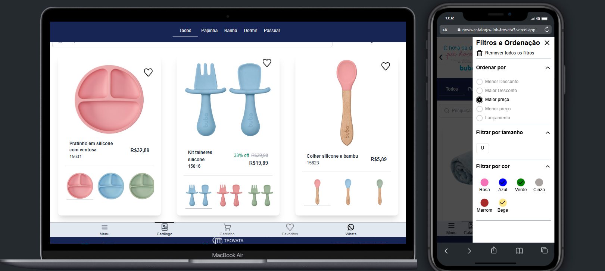

<h1 align="center">CatalogoLink</h1>

> 📱 Bem-vindo ao **CatalogoLink**, seu catálogo de produtos online otimizado para dispositivos móveis!
 
🗔 Confira a aplicação: https://novo-catalogo-link-trovata3.vercel.app/  
  

## :page_facing_up: Explicação
O **CatalogoLink** é um protótipo de front-end para um catálogo de produtos online, projetado com foco na experiência móvel. A plataforma permite aos usuários visualizar produtos, filtrar por categoria, buscar produtos, e adicionar itens ao carrinho ou à lista de favoritos. É uma plataforma simples e eficiente para compras online, com uma interface adaptada para dispositivos móveis.

O projeto foi desenvolvido utilizando **Vue.js** no frontend, **Vuex** para gerenciamento de estado, **TailwindCSS** com **DaisyUI** para o design responsivo e **TypeScript** para garantir tipos fortes e robustez no código.

## 📁 Seções da página

- **Catálogo**: Página inicial com todos os produtos da empresa. Os usuários podem filtrar os itens por categorias, buscar na barra de pesquisa, e ordenar por preço, desconto, cor, tamanho e outras opções. Além disso, podem adicionar os produtos aos favoritos ou ao carrinho de compras.
- **Favoritos**: Página dedicada aos produtos marcados como favoritos. O usuário pode visualizar todos os itens que gostou e também adicioná-los ao carrinho.
- **Carrinho**: Exibe os itens adicionados ao carrinho. A partir desta página, os usuários podem finalizar a compra e enviar o pedido via WhatsApp.
- **Configurações**: Página de configurações que permite ao usuário escolher entre três tipos de layout para visualizar os produtos (grade, lista ou carrossel).

## 🚀 Tecnologias Utilizadas

### 💻 Interface do Usuário

- **Vue.js** → Framework JavaScript para construir interfaces reativas e dinâmicas.
- **TailwindCSS** → Framework CSS utilitário para criar designs modernos e responsivos de forma eficiente.
  - Design modular e flexível.
  - Suporte a componentes reutilizáveis com classes utilitárias.
- **DaisyUI** → Biblioteca de componentes baseados em TailwindCSS para construir interfaces de usuário modernas e acessíveis com estilo consistente.
  - Componentes como botões, formulários e cartões prontos para uso.
  - Suporte a modos de tema, como claro e escuro.

### 🔄 Gerenciamento de Estado

- **Vuex** → Biblioteca para gerenciamento de estado centralizado no Vue.js, usada para armazenar e gerenciar os dados de produtos, favoritos e carrinho de compras de forma eficiente.
  - Facilita o compartilhamento de estado entre componentes.
  - Ação assíncrona para carregar produtos e realizar operações no carrinho.

### 📝 Tipagem e Desenvolvimento

- **TypeScript** → Linguagem que adiciona tipagem estática ao JavaScript, proporcionando mais segurança e robustez no código.

## 📲 Funcionalidades

### Catálogo:
- **Visualização de Produtos**: Todos os produtos são exibidos com a opção de filtragem por categorias, pesquisa por nome, e ordenação por preço, desconto, cor, tamanho, etc.
- **Favoritos e Carrinho**: Os usuários podem adicionar produtos à lista de favoritos ou ao carrinho para compras futuras.
  
### Favoritos:
- **Lista de Favoritos**: Os produtos marcados como favoritos podem ser visualizados e movidos para o carrinho de compras.

### Carrinho:
- **Finalização da Compra**: O carrinho exibe os produtos selecionados e permite ao usuário enviar a lista de itens via WhatsApp para realizar a compra.

### Configurações:
- **Escolha de Layout**: O usuário pode alternar entre três layouts diferentes para visualizar os produtos: grade, lista ou carrossel.

## 🤝 Colaboradores

Agradecemos às seguintes pessoas que contribuíram para este projeto:

<table>
  <tr>
    <td align="center">
      <a href="#">
         
        
          <b>Diogo Kimisima</b>
        
      </a>
    </td>
  </tr>
</table>

## 📝 Licença

Este projeto está sob licença. Consulte o arquivo <a href="https://github.com/diogokimisima/CatalogoLink3/blob/main/LICENSE">LICENSE</a> para obter mais detalhes.

<a href="#top">Volte para o topo</a>
